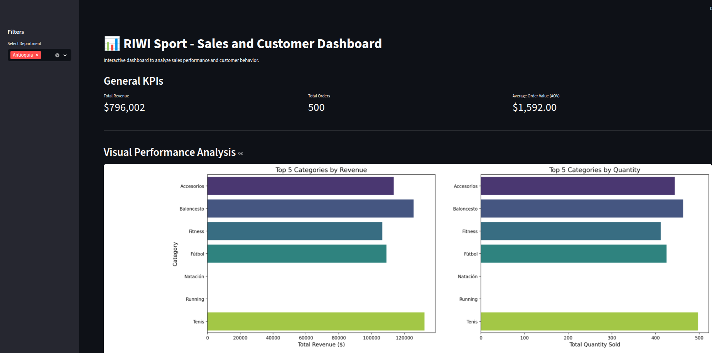

    
# RIWI Sport - Sales and Customer Analysis

## Project Overview

This project presents a comprehensive data analysis of sales and customer behavior for RIWI Sport, a fictional sporting goods retailer in Colombia. The goal is to measure client and sales performance, identify key trends, and provide data-driven recommendations to guide commercial actions by category and city.

The analysis is conducted in a Jupyter Notebook and culminates in an interactive web dashboard built with Streamlit.

## Tech Stack

| Category | Technologies |
|----------|--------------|
| Language | Python |
| Data Tools | Pandas, NumPy |
| Database | PostgreSQL |
| Visualization | Matplotlib, Seaborn |
| Dashboard | Streamlit |
| Environment | dotenv, virtualenv |
| Dev Tools | Jupyter Notebook, Git |

## Key Features

- **Database Integration:** Connects to a PostgreSQL database to fetch transactional data.
- **Data Processing:** Cleans and preprocesses data using `pandas` for robust analysis.
- **KPI Calculation:** Computes essential business and statistical metrics (AOV, customer spend distribution, top performers).
- **Data Visualization:** Generates insightful charts with `matplotlib` and `seaborn` to visualize trends and distributions.
- **Segmentation Analysis:** Explores performance differences across geographical locations (cities) and product categories.
- **Interactive Dashboard:** Presents all findings in a user-friendly Streamlit web application.

## Project Structure

```bash
riwi-sport-data-analysis/
├── .venv/                  # Virtual environment
├── notebooks/
│   └── 01_analysis.ipynb   # Jupyter Notebook with data analysis
├── scripts/                
│ └── RiwiSport.sql         # SQL script to set up the database
├── src/
│   └── db/
│       ├── __init__.py     
│       └── database.py     # Module to handle database connections
├── app.py                  # Streamlit dashboard application script
├── .env                    
├── .env.example            # Example environment variables file
├── .gitignore               
├── README.md               # Project documentation 
└── requirements.txt        # Python dependencies
```

## Getting Started

Follow these instructions to set up and run the project locally.

### Prerequisites

- Python 3.9+
- PostgreSQL server installed and running.
- A database management tool like Navicat or pgAdmin (optional but recommended).

### 1. Clone the Repository

```bash
git clone https://github.com/Elimge/riwi-sport-data-analysis.git
cd riwi-sport-data-analysis
```

### 2. Set Up the Python Environment

Create and activate a virtual environment, then install the required packages.

``` bash
# Create virtual environment
python -m venv .venv

# Activate it
# On Windows:
.venv\Scripts\activate
# On macOS/Linux:
source .venv/bin/activate

# Install dependencies
pip install -r requirements.txt
```

### 3. Set Up the Database

1.  Create the Database: Using your PostgreSQL tool, create a new database named riwi_sport_db (ensure it uses UTF-8 encoding).

2.  Run the SQL Script: Execute the scripts/RiwiSport.sql script against the newly created riwi_sport database. This will create all necessary tables and populate them with seed data.

### 4. Configure Environment Variables

1.  Create a file named .env in the root of the project by copying the example file:
``` bash    
# On Windows:
copy .env.example .env
# On macOS/Linux:
cp .env.example .env
``` 
  
2.  Open the .env file and replace the placeholder values with your local PostgreSQL credentials.

### 5. Run the Project

You can either explore the static analysis or run the interactive dashboard.

*   To run the Jupyter Notebook:

``` bash 
jupyter lab
``` 
  
Then, open `notebooks/01_analysis.ipynb.` Also you can use Jupyter Notebook on VSCode. 

* To run the Streamlit Dashboard:
``` bash 
streamlit run app.py
```      
This will open the interactive dashboard in your web browser.

## Dashboard Preview



## Executive Summary & Key Findings

This section can be a brief version of the report, highlighting the main insight.

The analysis revealed a dual-market structure within the "Fitness" category. While it has the lowest median item price, it also accounts for a significant number of high-value outlier sales. This suggests two distinct customer segments: a mass market for low-cost items and a niche market for premium equipment.

Recommendation: We recommend segmenting the marketing strategy for "Fitness" to target these two groups independently, with the goal of increasing the average order value for the mass-market segment and improving the repurchase rate for the premium segment.

## License

This project is licensed under the MIT License - see the [LICENSE](LICENSE) file for details.

## Author   

* **Miguel Canedo Vanegas** - [GitHub](https:github.com/Elimge)
* **Email**: `elimge@outlook.com`