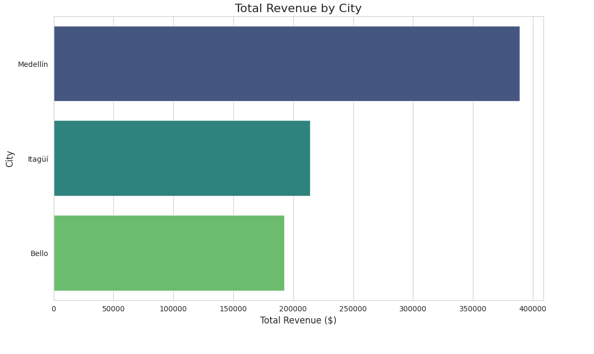
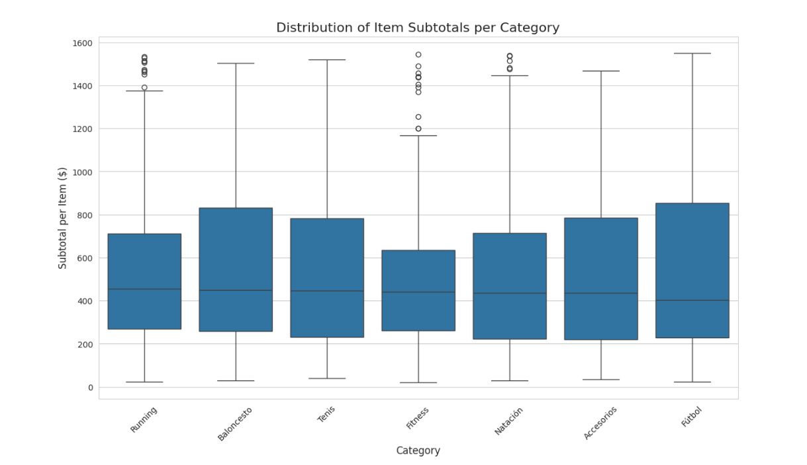
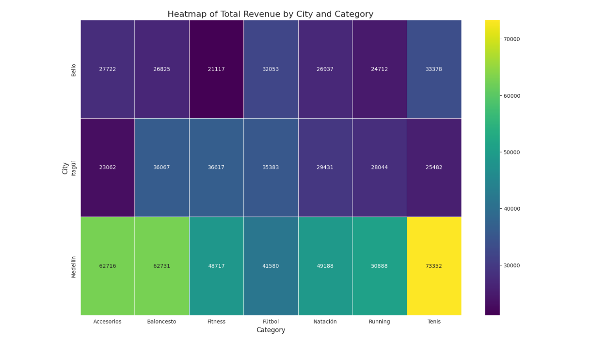

# RIWI Sport: Data Analytics Executive Summary

**Date:** October 26, 2025
**Author:** Miguel Canedo Vanegas
**Objective:** To analyze sales and customer data to identify key performance trends and provide actionable recommendations.

---

## 1. Executive Summary

Our analysis of RIWI Sport's transactional data reveals strong overall performance, with **Medellín** standing out as the primary revenue-driving market, particularly dominant in the **Tennis** category.

The most significant strategic finding is the **dual-market structure within the "Fitness" category**. While it appears to be a low-price category based on its median sale value, it uniquely concentrates a high number of premium, high-cost sales. This indicates an untapped opportunity to tailor marketing and sales strategies to two distinct customer segments: a high-volume, low-cost segment and a high-value, niche premium segment.

We recommend a **segmented commercial strategy for "Fitness"** to maximize revenue by increasing the average order value for the mass-market segment and enhancing customer lifetime value in the premium segment.

---

## 2. Key Performance Indicators (KPIs)

| Metric                        | Value           | Insight                                                               |
| ----------------------------- | --------------- | --------------------------------------------------------------------- |
| **Total Revenue**             | `$796,002`      | Strong overall sales performance.                                     |
| **Average Order Value (AOV)** | `$1,592.00`     | Represents a healthy average transaction size.                        |
| **Customer Spend CV**         | `44.68%`        | High variability in customer spending, suggesting diverse buyer personas. |
| **Top Category (Revenue)**    | `Tennis`        | Tennis is the most lucrative category, driven heavily by Medellín.    |

---

## 3. Key Visualizations

### Overall Market Performance by City

Medellín is the clear leader, generating nearly as much revenue as Itagüí and Bello combined.

### Sales Distribution by Category

The boxplot highlights that "Fitness" has the lowest median subtotal but the highest number of high-value outliers, confirming its dual nature.

### Revenue Heatmap: City vs. Category

This heatmap visually confirms Medellín's dominance across all categories, especially in Tennis. It also shows opportunities, such as the relatively low performance of "Running" in Itagüí compared to other cities.

---

## 4. Actionable Recommendation

**Recommendation:** Implement a segmented marketing strategy for the "Fitness" category.

1.  **Premium Segment:**
    *   **Action:** Create targeted email campaigns for customers who have purchased high-value fitness items (`> $500`), offering complementary premium accessories or new equipment launches.
    *   **Goal:** Increase the repurchase rate of this segment by 20% over the next quarter.

2.  **Mass-Market Segment:**
    *   **Action:** Promote "starter kits" and product bundles for items below the category median price to increase the average order value.
    *   **Goal:** Lift the AOV for this segment by 10%.